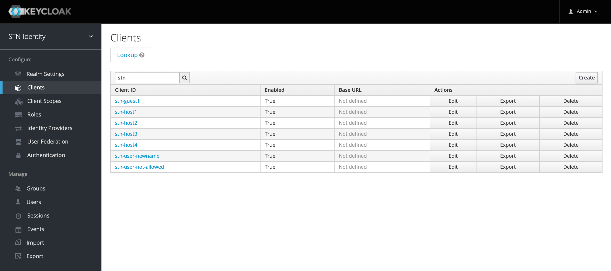
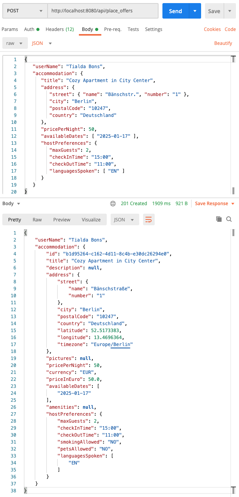
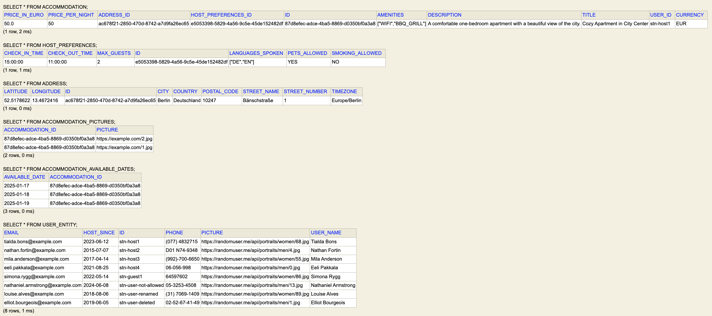
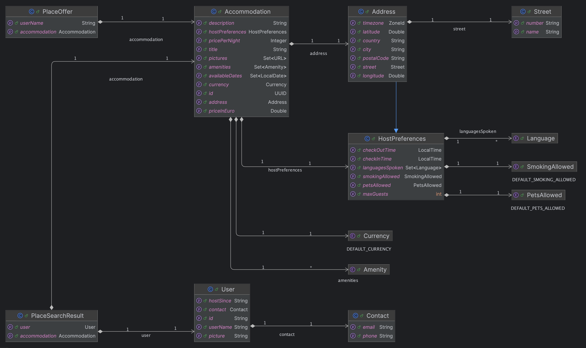
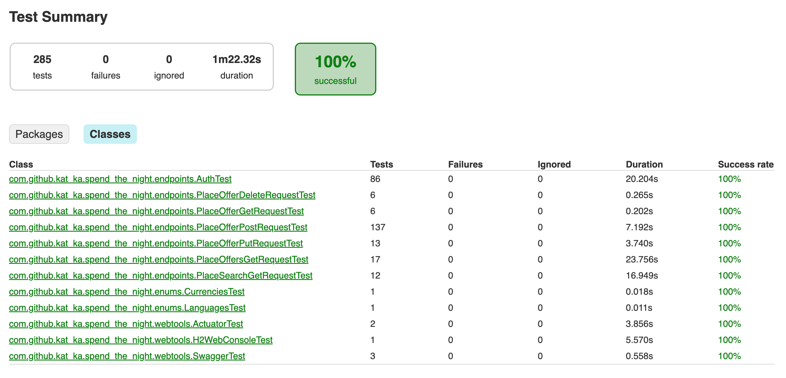

# spend-the-night API documentation

**spend-the-night** is a Java Spring Boot REST API designed for managing and discovering accommodation offers. It allows users to create, update, search, and delete place offers with secure access via JWT and OAuth2.

### Table of Contents
- [Deployment](#deployment)
- [Request Authorization](#request-authorization)
- [OpenAPI with Swagger UI](#openapi-with-swagger-ui)
- [Datasource](#datasource)
- [Request Validation](#request-validation)
- [Testing](#testing)
- [Actuator](#actuator)

### Deployment

Define the following properties in the main **application.properties** file or use environment variables:

| Property Key                       | Environment Variable            |
|------------------------------------|---------------------------------|
| `custom.auth.server.domain`        | `STN_AUTH_SERVER_DOMAIN`        |
| `custom.auth.server.realm`         | `STN_AUTH_SERVER_REALM`         |
| `custom.auth.server.scope.publish` | `STN_AUTH_SERVER_SCOPE_PUBLISH` |
| `custom.auth.server.scope.view`    | `STN_AUTH_SERVER_SCOPE_VIEW`    |

**Run the application:**

```
$ ./gradlew bootRun
```

**Note:** For tests to run successfully, the client secrets and tokens also have to be included in the test **application.properties** file.

### Request Authorization

The API uses JWT tokens for authorization and Keycloak as the OAuth2 resource server. Only place offer management and search endpoints are available, user management is not provided.

- **User Data:** Example data is taken from https://api.randomuser.me and can be found in **UserData.java**.
- **User Identification:** API requests use userName, while the User ID matches the Keycloak client ID.
- **Scopes:** Access control is defined through "publish" for managing offers and "view" for searching.

Corresponding Keycloak clients for managing permissions are pre-configured:

[](Keycloak_screenshot)

Show access token in Keycloak or:

```
curl -H "Content-Type: application/x-www-form-urlencoded" \
  -d "client_id=xxx" \
  -d "client_secret=xxx" \
  -d "grant_type=client_credentials" \
  -X POST {AUTH_SERVER_DOMAIN}/auth/realms/{AUTH_SERVER_REALM}/protocol/openid-connect/token
```

Authorize API request with header `"Authorization: Bearer {access_token}"`

Here is an example JSON request body:

```
{
   "userName": "Tialda Bons",
   "accommodation": {
      "title": "Cozy Apartment in City Center",
      "description": "A comfortable one-bedroom apartment with a beautiful view of the city.",
      "address": {
         "street": {
            "name": "Schreinerstr.",
            "number": "1"
         },
         "city": "Berlin",
         "postalCode": "10247",
         "country": "Deutschland"
      },
      "pictures": [
         "https://example.com/1.jpg",
         "https://example.com/2.jpg"
      ],
      "pricePerNight": 50,
      "currency": "EUR",
      "availableDates": [
         "2025-01-17",
         "2025-01-18",
         "2025-01-19"
      ],
      "amenities": [
         "WIFI",
         "BBQ_GRILL"
      ],
      "hostPreferences": {
         "maxGuests": 2,
         "checkInTime": "15:00",
         "checkOutTime": "11:00",
         "smokingAllowed": "NO",
         "petsAllowed": "YES",
         "languagesSpoken": [
            "EN",
            "DE"
         ]
      }
   }
}
```

with a POST request for creating a new accommodation offer:

[](Postman_screenshot)

### OpenAPI with Swagger UI

Access the OpenAPI documentation and test endpoints via Swagger UI:

- **Swagger UI:** [http://localhost:8080/api/swagger-ui.html](http://localhost:8080/api/swagger-ui.html)
- **API Docs:** [http://localhost:8080/api/v3/api-docs](http://localhost:8080/api/v3/api-docs)

To authorize API requests in Swagger, click "Authorize" in the top-right corner and enter the Bearer token without the word "Bearer".

Example POST request:

[](Swagger_UI_screenshot)

### Datasource

The application runs with a H2 in-memory database. The database web console can be accessed at   [http://localhost:8080/h2-console](http://localhost:8080/h2-console).

H2 web console configuration with default values:

**Saved Settings:** Generic H2 (Embedded)  
**Setting Name:** Generic H2 (Embedded)  
**Driver Class:** org.h2.Driver  
**JDBC URL:** jdbc:h2:mem:testdb;DB_CLOSE_DELAY=-1  
**User Name:** sa  
**Password:** *leave blank*

Tables showing sample data:

[](Database_sreenshot)

### Request Validation

Class diagram for the request body:

[](Class_diagram)

The following table includes validation requirements for the request body attributes:

| class | attribute | type | format | nullable | default | unique | generated | restriction |
|---------------|----------------|----------------|--------|----------|---------|----------------------------------------|------------|-------------|
| <sub>PlaceOffer</sub> | <sub>userName</sub> | <sub>String</sub> | | <sub>false</sub> | | <sub>false</sub> | <sub>false</sub> | <sub>not blank</sub> |
| | <sub>accommodation</sub> | <sub>Accommodation</sub> | | <sub>false</sub> | | <sub>false</sub> | <sub>false</sub> | |
| <sub>Accommodation</sub> | <sub>id</sub> | <sub>UUID</sub> | | <sub>false</sub> | | <sub><mark>true</mark></sub> | <sub><mark>true</mark></sub> | |
| | <sub>title</sub> | <sub>String</sub> | | <sub>false</sub> | | <sub><mark>true for title and User id combination</mark></sub> | <sub>false</sub> | <sub>not blank</sub> |
| | <sub>description</sub> | <sub>String</sub> | | <sub><mark>true</mark></sub> | <sub>null</sub> | <sub>false</sub> | <sub>false</sub> | |
| | <sub>address</sub> | <sub>Address</sub> | | <sub>false</sub> | | <sub>false</sub> | <sub>false</sub> | <sub>must be valid</sub> |
| | <sub>pictures</sub> | <sub>Set&lt;URL&gt;</sub> | | <sub><mark>true</mark></sub> | <sub>null</sub> | <sub>false</sub> | <sub>false</sub> | <sub>all items !=&nbsp;null</sub> |
| | <sub>pricePerNight</sub> | <sub>Integer</sub> | | <sub>false</sub> | | <sub>false</sub> | <sub>false</sub> | <sub>&gt;= 0</sub> |
| | <sub>currency</sub> | <sub>enum</sub> | | <sub>false</sub> | <sub>EUR </sub> | <sub>false</sub> | <sub>false</sub> | |
| | <sub>priceInEuro</sub> | <sub>Double</sub> | | <sub>false</sub> | | <sub>false</sub> | <sub><mark>true</mark></sub> | |
| | <sub>availableDates</sub> | <sub>Set&lt;LocalDate&gt;</sub> | <sub>["yyyy-MM-dd"]</sub> | <sub>false</sub> | | <sub>false</sub> | <sub>false</sub> | |
| | <sub>amenities</sub> | <sub>enum Set</sub> | | <sub><mark>true</mark></sub> | <sub>null</sub> | <sub>false</sub> | <sub>false</sub> | <sub>at least 1 item,<br>all items !=&nbsp;null</sub>
| | <sub>hostPreferences</sub> | <sub>HostPreferences</sub> | | <sub>false</sub> | | <sub>false</sub> | <sub>false</sub> | |
| <sub>Address</sub> | <sub>street</sub> | <sub>Street</sub> | | <sub>false</sub> | | <sub>false</sub> | <sub>false</sub> | |
| | <sub>city</sub> | <sub>String</sub> | | <sub>false</sub> | | <sub>false</sub> | <sub>false</sub> | <sub>not blank</sub> |
| | <sub>postalCode</sub> | <sub>String</sub> | | <sub>false</sub> | | <sub>false</sub> | <sub>false</sub> | <sub>not blank</sub> |
| | <sub>country</sub> | <sub>String</sub> | | <sub>false</sub> | | <sub>false</sub> | <sub>false</sub> | <sub>not blank</sub> |
| | <sub>latitude</sub> | <sub>Double</sub> | | <sub>false</sub> | | <sub>false</sub> | <sub><mark>true</mark></sub> | |
| | <sub>longitude</sub> | <sub>Double</sub> | | <sub>false</sub> | | <sub>false</sub> | <sub><mark>true</mark></sub> | |
| | <sub>timezone</sub> | <sub>ZoneId</sub> | | <sub>false</sub> | | <sub>false</sub> | <sub><mark>true</mark></sub> | |
| <sub>Street</sub> | <sub>name</sub> | <sub>String</sub> | | <sub>false</sub> | | <sub>false</sub> | <sub>false</sub> | <sub>not blank</sub> |
| | <sub>number</sub> | <sub>String</sub> | | <sub>false</sub> | | <sub>false</sub> | <sub>false</sub> | <sub>not blank</sub> |
| <sub>HostPreferences</sub> | <sub>maxGuests</sub> | <sub>int</sub> | | <sub>false</sub> | | <sub>false</sub> | <sub>false</sub> | <sub>&gt; 0</sub>
| | <sub>checkInTime</sub> | <sub>LocalTime</sub> | <sub>"HH:mm"</sub> | <sub>false</sub> | | <sub>false</sub> | <sub>false</sub> | |
| | <sub>checkOutTime</sub> | <sub>LocalTime</sub> | <sub>"HH:mm"</sub> | <sub>false</sub> | | <sub>false</sub> | <sub>false</sub> | |
| | <sub>smokingAllowed</sub> | <sub>enum</sub> | | <sub>false</sub> | <sub>NO</sub> | <sub>false</sub> | <sub>false</sub> | |
| | <sub>petsAllowed</sub> | <sub>enum</sub> | | <sub>false</sub> | <sub>NO</sub> | <sub>false</sub> | <sub>false</sub> | |
| | <sub>languagesSpoken</sub> | <sub>enum Set</sub> | | <sub>false</sub> | | <sub>false</sub> | <sub>false</sub> | <sub>at least 1 item,<br>all items !=&nbsp;null</sub> |

### Testing

Tests are written in [Groovy](https://groovy-lang.org/single-page-documentation.html) using the [Spock](https://spockframework.org/spock/docs/2.3/all_in_one.html) framework.

Results are available at: **{ROOT_DIR}/spend-the-night/build/reports/tests/test/index.html**

[](Test_results_screenshot)

### Actuator

Monitoring the API with Spring Actuator endpoints like:

- **Main Actuator:** [http://localhost:8080/api/actuator](http://localhost:8080/api/actuator)
- **Health Check:** [http://localhost:8080/api/actuator/health](http://localhost:8080/api/actuator/health)
- **Bean Information:** [http://localhost:8080/api/actuator/beans](http://localhost:8080/api/actuator/beans)
- **Prometheus Metrics:** [http://localhost:8080/api/actuator/prometheus](http://localhost:8080/api/actuator/prometheus)
- **App Metrics:** [http://localhost:8080/api/actuator/metrics](http://localhost:8080/api/actuator/metrics)
